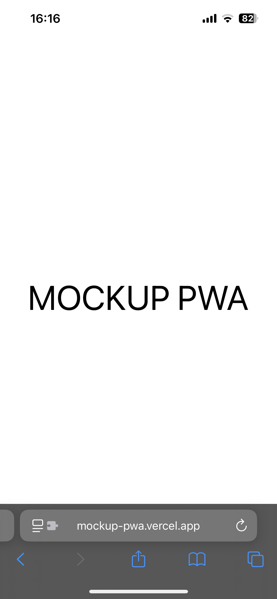
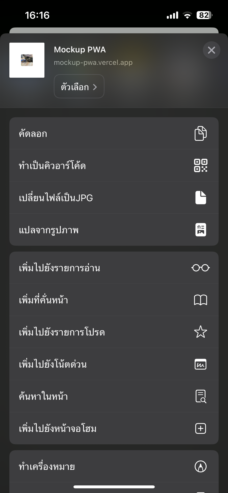
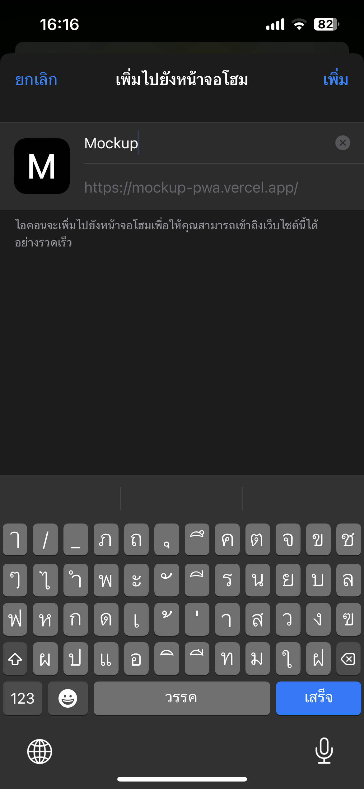
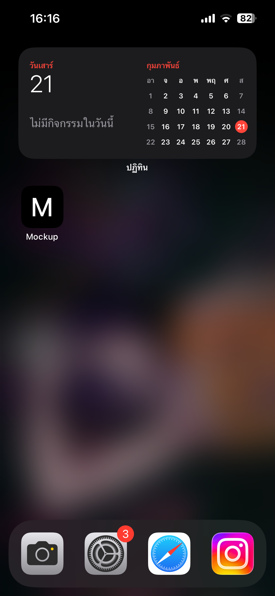

# startup

    <kbd>
        <h3>Enter <a href="https://mockup-pwa.vercel.app">Link</a></h3>
        
        <h3>Share button -> add to home screen (เพิ่มไปยังหน้าจอโฮม) </h3>
        
        <h3>Click add(เพิ่ม)</h3>
        
        <h3>Finish PWA</h3>
        
    </<kbd>

